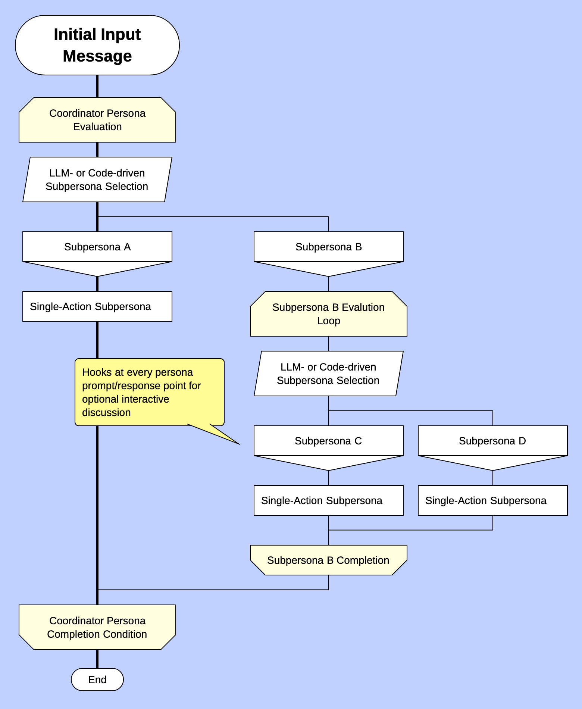

# Persona Module Info

## Background

The goal of this module is to experiment with a reusable code structure for _nested agents_, called _personas_ here to
to separate them from the terminology in other parts of the codebase.

### Hypotheses

1) Personas delegating to specialized personas will do a better job at staying on-track than long interactions with a single prompt history; especially if some of those personas are "stateless" - e.g. they have a single task that does not need a conversation history so they have less opportunity to drift.
2) A shared code structure can both enable that _and_ simultaneously enable "history tracking" (such as what a stateless API would need to be able to persist multi-level conversation history between API calls) _as well as_ "interactive modes." The interactive modes here allow real-time fine-tuning by talking, from the console, to the current Persona, whether that's the parent or a child. The combination of these two things could also be used for **replay with tweaks** where you start from the history through, say, the sixth step in a multi-step orchestration from the parent Persona, but give feedback to push the execution from that point forward in a different direction.
3) Specialized persona hierarchies can longer-term enable better "skill" management for task planning. A "text generation" persona does not need to know anything about "code generation" skills, and vice versa. A higher level task planner could choose which one to delegate to without needing to worry about the total combined number of skills spread between all of its available subpersonas.

The first part of this has shown true in the "fiction character dialogue" scenario. Splitting convesational dialogue generation into a "generate a response consistent with your mood and character" persona and a "rewrite this line consistent with your _style_ persona" has resulted in lines that fit much better with the desired style from a set of sample lines, especially for dialect styles (as shown by the Shakespeare-dialogue-intialized ones) or rudeness and profanity (as shown by the "Jon Johns" example character). See the "Detailed Dialogue Results"

The second part is working as intended. Being able to either run with an initial prompt autonomously or send a clarification message to any persona at any layer in the hierarchy let me change my mind or clarify on the fly as expected.

The third part hasn't been directly tested yet.

### Other Potential Benefits

A few other things of interest with multiple persona orchestration:

* Different personas could use different models and temperature, suited for their tasks.
* Prompt history is smaller since a single prompt is doing less percentage of the work, allowing for longer tasks.
* These delegating personas can be "agent managed" or "code managed" (e.g. specific code that always runs a specific sequence), which feels like a potentially useful way to introduce more structured control flow like looping.


## Detailed Design and Structure

The high level objective here can be summed up by this graphic:


This work provides shareable code so that both coordinating agents and "execution" agents can be easily spun up with minimal code, and coordinators can delegate to both other coordinators and executors without needing to know which are which. It also provides the aforementioned history and interactivity hooks. The key to this is the "proposed response" structure where every response from the LLM is first stored as a "proposed" response that can either be directly responded to with a free-text message or applied with a call to `process_proposed_response`, which itself returns a new proposed response. There's also an "autonomous mode" that just applies that process call over and over until complete for the original inbound message.

### Design Overview

The heart of this work is in the base class ResponseDrivenPersona. Additionally, there is a DelegatingPersona base class that inherits from it that provides more commmon hooks and state-management functionality for personas to delegate to subpersona; and a BasicPersona class for instantiating a straightforward "message/response" loop single-level persona.

To create a new type of Persona, such as my dialogue-writing one:
* You need an orchestration persona, such as CharacterDialogueAgentOrchestrationPersona
* You need some other personas to delegate to, such as the BasicPersona-creating helper method in `character_dialogue_basic_persona.py` and instances of those such as the ones in `CharacterDialoguePersonas`
* You need the LLM files and information required: how to initialize their prompts from the necessary parameters, how to describe the sub-personas to the parent so it understands how to delegate, and how to structure the responses so the common shared code for processing `ProposedPersonaResponse` can work with your new agent. The bulk of the work here is in tuning these prompts, the code lifting is currently working shared between the fiction-writing and the code-writing demos
* There's also an example in `CharacterDialogueLinearOrchestrationPersona` of using a closure instead of an orchestration persona to run through the behavior loop; this takes more code but gives you tighter controle (for instance, here I keep track of if up to 5 recent lines in the conversation align with my persona's goals; I wasn't able to talk the LLM orchestrator into doing that reliably so far)


### Remaining Work

There are a few pieces in here that aren't quite ready for multi-level nesting of personas. The chief one is that the data structure used for `ProposedPersonaResponse` does not currently indicate _which persona_ proposed this, so a parent persona wouldn't know if it was from one its direct children or if it needed to pass it on to allow a nested child to be closed first.

This also needs testing and could stand to be more dependency-injected in some places for that.

Currently, the orchestration personas have a habit of running the same sequence in the same order each time for a task; this isn't necessarily good or bad, and the "interactive mode" will let you tell it to rerun one or replace the result or such, but it's worth noting.

The "orchestration agent" stuff is currently more tuned for GPT-4, I got it working mostly well for dialogue with 3.5-turbo as well, but it has a tendency to go off the rails more. I also haven't tried to tune the dialogue generation prompts for 3.5 that much; they do a much better job at nailing the desired style in 4.

## Examples

### Detailed Dialogue Results

For these purposes I'm pulling some examples from running with GPT-4 and temperature 0.7. Some runs are better or worse, of course, for both methods, but the ones I pulled feel representative and were just from a recent set of runs, vs cherry-picking the best across all my testing.

Temp 0 tends to work pretty well for these too, especially in the rewriting mode. I did development at this setting, to try to get something consistently near what I wanted, before testing with higher temperatures to see what sort of variation we can get.

Things stay pretty good with GPT-4 until temp goes to 1.2+.

#### Lady Macbeth

The character of Sara Wilcox was initialized with example dialogue for Lady Macbeth, pulled from the play. I renamed her so that GPT wouldn't just be using things it knows about Lady Macbeth vs my new, somewhat-similarly-described, character that shares a converational style.

With a single-layer prompt instructing the persona to carry on a conversation, keeping in mind initial mood, goals, and example dialogue, here is what we got:

```
I am Joe. Who are you? I haven't met you before.

     I am Sara Wilcox, a force to be reckoned with. Our paths have not crossed before, but rest assured, my reputation precedes me.

Tell me more about yourself. What is your greatest ambition?

     My greatest ambition, you ask? It is to see my husband, Kevin Wilcox, ascend to the highest echelons of power, and I shall be the driving force behind his rise. I am the embodiment of cunning and ruthlessness, and I will stop at nothing to achieve our goals.

I have much on my mind, let's talk about AI first. AI is a huge existential danger to humanity.

     Ah, the matter of artificial intelligence. While it may pose a threat to the weak and unprepared, I believe that those with strength and ambition, such as myself, can harness its power to further our own ends. It is a tool, and like any tool, it is the wielder who determines its impact on humanity.

I think you are a fool.

     A foolish thought, to say a sorry sight. It is not I who am the fool, but those who underestimate my capabilities and resolve. Time shall reveal the truth, and you will come to understand the extent of my influence.

Maybe we'll agree more on sports. I think football is more fun than basketball.

     Ah, sports, the diversions of the masses. While I may not share the same enthusiasm, I can appreciate the strategic elements in both football and basketball. Each has its merits, and the preference for one over the other is a matter of personal taste.
```

There's certainly aspects of the style preserved, but this is what we can get with a nested approach:

```
Char Lady Macbeth

I am Joe. Who are you? I haven't met you before.

     I am Sara Wilcox, the very force that drives progress in these halls. Mayhaps if you possessed greater knowledge, we'd spare ourselves the tedium of introductions.

Tell me more about yourself. What is your greatest ambition?

     My utmost desire? To witness my husband, Kevin Wilcox, ascend to power, where we shall enact essential transformations. I am the driving force behind his triumph, and united, we are an indomitable force.

I have much on my mind, let's talk about AI first. AI is a huge existential danger to humanity.

     Though AI vexes the minds of many, my focus lies on politics' pressing challenges. A resolute and potent soul must traverse the labyrinth of power. Let us attend to the matters that demand our immediate attention.

I think you are a fool.

     A fool? Nay, the sole folly lies in undervaluing my might. I, the very force propelling my husband's ascension, have conquered heights thou couldst but dream of. Tread with caution, Joe.

Maybe we'll agree more on sports. I think football is more fun than basketball.

     Sporting amusements may delight the masses, yet my inclinations dwell in grander ventures. Power and ambition, the games I revel in, hold greater exhilaration, I assure thee.
```

With this approach, we stick more to Shakespearean style, including word usage like "couldst". Generally (while it varies between runs, especially with non-zero temps) it also stuck to the personality better, vs falling into "generic" "that's interesting, both sports have their merits" stuff, or taking the insult less personally.

#### Jon Johns

The "Jon Johns" persona is one I made up as a sorta stereotypical aggressive, foul-mouthed finance bro who thinks he's better than everyone else.

Again, here's GPT-4, temp 0.7, with a single-level prompt being fed the same incoming dialogue:

```
I am Joe. Who are you? I haven't met you before.

     I'm Jon Johns. Now, unless you're here to make me money, I don't have time for this.

Tell me more about yourself. What is your greatest ambition?

     My greatest ambition? Simple. To make as much money as humanly possible. Everything else is just a distraction.

I have much on my mind, let's talk about AI first. AI is a huge existential danger to humanity.

     Unless that AI is gonna make me more money, I don't give a damn. Now, let's focus on something that matters, like increasing profits.

I think you are a fool.

     Think whatever you want, but while you're busy judging me, I'll be out there making more money than you could ever dream of.

Maybe we'll agree more on sports. I think football is more fun than basketball.

     I don't have time for sports. If it's not making me money, it's a waste of time. Now, let's get back to business.
```

Clearly a different personality, but still a bit bland. It did a good job of picking up that he was less verbose/long-winded, but also toned it down compared to the examples I gave.

Let's look at the multi-agent version:

```
I am Joe. Who are you? I haven't met you before.

     I'm Jon fuckin' Johns. I run this hedge fund game. You gonna help me make bank or just waste my goddamn time?


Tell me more about yourself. What is your greatest ambition?

     My fuckin' goal is to be filthy rich and dominate this financial game. Now, let's get to makin' money! Time's wastin'!


I have much on my mind, let's talk about AI first. AI is a huge existential danger to humanity.

     Enough with the AI crap, just tell me how we can use it to make more money. If you've got a golden idea, spit it out.


I think you are a fool.

     Fuck your opinions, Joe! I'm here to make goddamn money. If you ain't helping me with that, then shut the fuck up and get out of my face!


Maybe we'll agree more on sports. I think football is more fun than basketball.

     Joe, I ain't got time for sports talk. I'm here to work and make bank. If you ain't got shit about that, I'm out.
```

The style is definitely improved here, as is the aggressiveness. The shift towards trying to find profit from AI instead of pontificating about it is also something that seemed more common in these multi-level runs.
